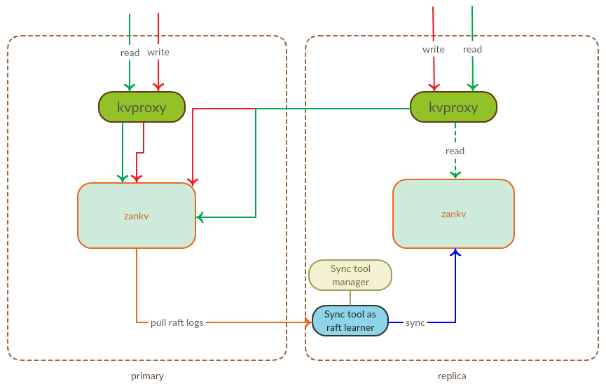

# 运维指南

## 部署配置说明

### 默认配置说明

zankv数据节点配置参数说明:
```
{
 "server_conf": {
  "cluster_id": "test-qa-alpha-1",   ### 集群id, 用于区分不同的集群
  "etcd_cluster_addresses": "http://127.0.0.1:2379,http://127.0.0.2:2379", ### etcd 集群地址列表
  "broadcast_interface": "eth0",  ### 绑定的网卡, 使用网卡可以避免每台机子配置绑定ip
  "broadcast_addr": "",   ### 绑定ip, 推荐使用网卡配置, 此项可以留空
  "redis_api_port": 12381,   ### redis协议监听地址端口
  "http_api_port": 12380,     ### http api 端口
  "grpc_api_port": 12382,     ### grpc内部集群通信端口
  "profile_port": 0,          ### debug数据端口, 默认是6666
  "data_dir": "/data/zankv",   ### 数据目录
  "data_rsync_module": "zankv",   ### rsync 模块, 名字必须保持和rsync配置吻合, rsync模块配置的数据目录路径必须和本配置的数据目录一致
  "local_raft_addr": "http://0.0.0.0:12379",  ### 内部raft 传输层监听地址
  "tags": null,    ### tag属性, 用于标识机器属性, rack-aware会使用此配置
  "syncer_write_only": false,    ### 此配置用于跨机房多集群部署, 默认不需要
  "syncer_normal_init": false,   ### 此配置用于跨机房数据同步初始化, 默认不需要
  "learner_role": "",            ### 配置raft learner角色, 用于跨机房同步, 默认不需要
  "remote_sync_cluster": "",     ### 跨机房集群的备机房地址, 默认不需要
  "state_machine_type": "",      ### 状态机类型, 用于未来区分不同的状态机, 暂时不需要配置,目前仅支持rocksdb
  "rsync_limit": 0,   ### 限制rsync传输的速度, 一般不需要配置, 会使用默认限制
  "election_tick": 30,   ### raft leader失效间隔, 建议使用默认值
  "tick_ms": 200,   ### raft 心跳包间隔, 建议使用默认值
  "use_redis_v2": true,  ### 是否在raft entry里面启用新的redis序列化, 默认不开启, 0.8.4以上版本支持, 不兼容低版本, 开启后可以提升写入性能
  "log_dir": "/data/logs/zankv", ### 设置glog目录, 0.8.4以上版本支持
  "use_rocks_wal": false,  ### 是否使用rocksdb存储raft wal日志, 默认不启用, 启用后可以优化内存占用, 性能会有一定影响
  "shared_rocks_wal": true, ### 是否在不同raft分组使用共享的rocksdb来存储wal, 默认不启用
  "wal_rocksdb_opts": {
      "use_shared_cache":true,
      "use_shared_rate_limiter":true,
      "rate_bytes_per_sec":80000000,
      "max_write_buffer_number":10,
      "optimize_filters_for_hits":true  ### 用于存储wal时, 可以配置此项提升性能, 因为wal查询都会命中
  },
  "rocksdb_opts": {   ### rocksdb参数参见调优
   "verify_read_checksum": false,
   "use_shared_cache": true,
   "use_shared_rate_limiter": true
  },
  "max_scan_job": 0   ### 允许的最大scan任务并行数量, 一般使用内置的默认值
 }
}

```

namespace创建参数建议3副本, 分区数可以预估集群最大规模, 一般初始化设置为集群最大机器数*4, 预留部分扩容能力. 一般来说集群建议最小规模是4台机器, 16分区. 理论上可以通过加机器扩容到 50TB容量左右. 如果需要继续扩容, 可以再创建更多分区的新namespace来完成.

注意如果需要在较少的机器上创建较多分区数的namespace, 需要适当调小 rocksdb的 write_buffer_size参数以及namespace的snap_count参数, 以减少每个分区的内存占用

### rocksdb调优

由于底层使用rocksdb存储, 为了更好的适应各种硬件配置, 需要了解部分rocksdb的配置, 并根据具体环境做配置优化.
具体可配置的参数含义如下:
```
{
   "verify_read_checksum": false,  ### 读是否校验crc, 禁用可以减少CPU的使用, 大部分情况下可以禁用
   "block_size": 0,   ### block大小, 一般使用默认值即可, 建议8KB~64KB之间
   "block_cache": 0,  ### 建议使用默认值, 并且启用 use_shared_cache=true, 内部会自动根据操作系统可用内存调整.
   "cache_index_and_filter_blocks": true,  ### 是否将索引和filter放入block cache, 建议小内存机器设置true, 避免数据增长占用过多内存, 大内存>64GB内存可以使用false, 会将block索引都缓存在内存, 加速访问
   // 以下几个参数设置时, 注意保证 level0_file_num_compaction_trigger * write_buffer_size * min_write_buffer_number_tomerge = max_bytes_for_level_base减少写放大效应, 建议使用默认值, 如果机器内存较小, 可以适当等比例缩小
   "write_buffer_size": 0, 
   "min_write_buffer_number_to_merge": 0,
   "level0_file_num_compaction_trigger": 0,
   "max_bytes_for_level_base": 0,
   "max_write_buffer_number": 4,  #### 建议 2~6之间, 根据操作系统不同内存大小调整
   "target_file_size_base": 0,   ### 建议使用默认值
   "max_background_flushes": 0,  ### 建议使用默认值, rocksdb刷盘线程
   "max_background_compactions": 0,   ### 建议使用默认值, rocksdb compact线程
   "min_level_to_compress": 0,   ### 建议使用默认值
   "max_mainifest_file_size": 0,   ### 建议使用默认值
   "rate_bytes_per_sec": 20000000,   ### rocksdb后台IO操作限速, 建议设置避免IO毛刺, 建议限速 20MB ~ 50MB 之间
   "use_shared_cache": true,  ### 建议true, 所有rocksdb实例共享block cache
   "engine_type": "",  ### 支持rocksdb和pebble两种, 默认使用rocksdb
   "use_shared_rate_limiter": true   ### 建议true, 所有实例共享限速指标
}
```


## 创建namespace

往placedriver的leader节点发送如下API可以动态创建新的namespace

```
POST /cluster/namespace/create?namespace=test_p16&partition_num=16&replicator=3&data_version=value_header_v1&expiration_policy=wait_compact

data_version: 存储的数据版本, 不同版本序列化格式会有区别, namespace初始化后不能动态修改, 默认使用老版本, value_header_v1是目前唯一的新版本用于支持精确过期功能
expiration_policy: 配置过期策略, 默认使用非精确过期, 新版本支持wait_compact精确过期策略, 此策略下过期的数据不会返回给客户端, 过期数据的真实清理会等待compact时再判断是否需要清理.
```

关于ttl的说明:

默认使用非精确ttl, 非精确ttl使用的是报错过期key列表并且定期扫描的策略, 因此只能支持设置一次过期时间, 并且过期精度取决于扫描周期(默认5分钟).

如果需要类似redis的精确ttl(秒级)支持, 可以使用新的`wait_compact`过期策略, 这种过期策略会将过期时间和key的元数据放到一起, 每次读写的时候会检查是否已经过期, 从而实现更加精确的过期判断能力. 由于只是检查过期的元数据, 并不会真实删除, 因此需要等待底层compact的时候才能物理删除, 理论上空间回收会滞后. 注意, 新的过期策略必须使用新的数据版本`value_header_v1`

## 慢写动态限流说明

v0.8新版本开始, 增加了慢写入动态限流和预排队功能, 用于减少某些慢写入命令对其他命令的rt影响. 内部会周期性汇总写入命令在底层DB的rt耗时, 超过一定阈值后, 会被判断为不同程度的慢, 针对不同程度的慢写入, 会使用不同的预排队队列进行排队, 队列长度也会不同, 从而控制这些慢写入命令同时进入raft请求的个数, 来避免这些慢写入在raft apply队列排队写入时占用过多时间, 从而影响队列里面其他的写入rt. 如果超过一定的阈值, 还会触发直接拒绝限流. 

动态限流可以通过配置关闭 `POST /conf/set?type=int&key=slow_limiter_switch&value=0`


## 监控项说明

除了默认的stats接口, 还有如下几个新增的监控数据, 可以查看内部状态.

### Prometheus

通过数据节点的HTTP端口的`/metric`, 可以查看更多的监控数据, 主要有一下几个大类:

- 延迟监控: 包括db存储层的写入rt, raft各个阶段的rt, 集群端到端响应rt等
- 慢写监控: 包括表+命令纬度的底层DB慢写入统计, 统计历史rt分布, 慢写限流次数, 慢写预排队次数, 慢写预排队时间分布
- 事件监控: 包括各类事件的发送次数统计, 比如leader切换事件, 各类错误发生次数统计
- 队列监控: 包括各类队列深度的监控, 比如raft待提交队列深度, 状态机待apply队列深度, 网络层待传输队列深度等
- 集合大小监控: 统计各种集合类型的集合大小分布, 用于判断大集合在各个表的分布情况

### topn

通过HTTP端口的`/stats?table_detail=true`, 可以查看更详细的key级别统计的topn数据, 包括:

- 按写入次数统计的topn写入key
- 按集合元素大小排序的对应的topn 集合key

统计结果按照一定的次数和最近时间综合进行淘汰

### SLOW_LOGS

部分重要影响集群性能的操作会以慢查日志的方式进行输出, 用于监控和排查一些业务不合理的数据使用导致的性能隐患. 目前有以下几种情况会输出慢日志:

- 写入命令在存储层执行时间超过一定的阈值
- 当某个集合元素大小超过一定的阈值

慢日志可以通过API `POST /slowlog/set?loglevel=0` 单独设置输出级别, 不同级别的输出阈值不同. (-1表示关闭)

## 操作和接口说明

rsync进程:用于异常恢复时传输zankv的备份数据

传输速度可以动态配置限速:

```json
POST /rsynclimit?limit=80000
```

集群的一些统计数据, 可以分别从placedriver和zankv的接口获取,统计数据接口如下:

placedriver API

```
/cluster/stats
获取集群总体状态, 标识集群是否稳定, 此请求需要发送到leader节点

/datanodes
获取存活的数据节点(zankv)信息, 存活节点数量有变更需要warning级别报警

POST /cluster/node/remove?remove_node=xxx
下线不用的节点, xxx信息使用获取节点数信息返回的node_id串替换, 下线节点会触发数据迁移, 等待迁移完成后, 观察log输出再停掉下线的节点.

```

zankv API

```
/kv/optimize
为了避免太多删除数据影响性能, 可以定期执行此API清理优化性能, 建议每几个月执行一次 (每台zankv机子错峰执行). rocksdb v6及以上新版本已经有部分优化, 因此可以不用执行.

/stats
获取统计数据,其中db_write_stats, cluster_write_stats中两个长度为16的数据对应的数据, 标识对应区间统计的计数器. 其中db_write_stats代表存储层的统计数据, cluster_write_stats表示服务端协议层的统计数据(从收到网络请求开始, 到回复网络请求结束), 具体的统计区间含义可以参考代码WriteStats结构的定义.

如果需要获取集群表统计信息, 需要加上参数table_details=true

/raft/stats
获取raft集群状态, 用于判断异常信息
```

动态配置支持int和string两种类型, 对应的更改和获取接口如下:

```json
POST /conf/set?type=int&key=xxx&value=xxx
POST /conf/set?type=str&key=xxx&value=xxx

GET /conf/get?type=int&key=xxx
GET /conf/get?type=str&key=xxx

目前可以动态配置的参数如下:
int类型:
check_snap_timeout - 检查快照超时时间, 单位秒
check_raft_timeout - 检查raft是否同步超时时间, 单位秒
max_remote_recover - 跨机房同步时, 最大同时同步的分区数
string类型:
ignore_startup_nobackup - 启动时是否忽略快照不存在的错误.
ignore_remote_file_sync - 是否忽略跨机房同步的快照传输
```

动态调整部分rocksdb参数使用如下API:
```
POST /db/options/set?key=xxx&value=xxx
```
说明: 目前仅有rocksdb底层存储支持动态调整, 可调整的key如下:
- "rate_limiter_bytes_per_sec": rocksdb的ratelimiter限流字节数调整
- "max_background_compactions": rocksdb后台compaction任务上限调整
- "max_background_jobs": rocksdb后台jobs任务上限调整


## 备份恢复

### 备份文件格式
备份工具备份的文件名格式:
datatype:yyyy-mm-dd:namespace:table.db, 每个不同类型的数据备份文件有一个相同的备份文件头, 数据内容和具体的数据格式有关.

#### 公共文件头格式

在所有的文件头会写入如下几个信息：

|字段|字节数|说明|
|----|----|----|
|MAGIC|5|魔数，目前为"ZANKV"|
|VERSION|4|	版本，目前为"0001"|
|NameSpace Len|4|namespace的长度|
|NameSpace|	变长,由namespace len指定| namespace名称|
|TableName Len|	4|	table name的长度|
|TableName|变长|table name|
|Type|1|类型。0:kv;1:hash;2:set;3:zset;4:list|

#### kv文件格式

kv文件中除去公共文件格式之外，就是key-value的内容。格式如下:

|字段|字节数|说明|
|----|----|----|
|Key Len| 4 |key的长度|
|Key|变长| key的内容|
|Value Len| 4 |value的长度|
|Value| 变长 |value的内容|


#### hash文件格式

除去公共文件格式之外，就是key-field-value的内容。格式如下:

|字段|字节数|说明|
|----|----|----|
|Key Len| 4 |key的长度|
|Key|变长| key的内容|
|Field number|	4	|所有field个数|
|field Len	|4|	field长度|
|field	| 变长 |field内容|
|Value Len| 4 |value的长度|
|Value| 变长 |value的内容|

#### set文件格式

#### list文件格式

#### zset文件格式

### 备份工具backup

```
backup -lookup lookuplist -ns namespace -table table_name [-data_dir backup -type all|kv[,hash,set,zset,list] -qps 100]
 
参数说明:
-lookup            zankv lookup服务器,可以是用","分割的一组服务器
-ns                 要备份的namespace
-table              要备份的table
-data_dir         备份目录，默认当前目录下打data目录
-type              要备份的数据结构类型，支持kv,hash,set,zset,list，all表示备份所有类型，输入all了，就不能输入其他的类型了，默认为all
-qps               速度控制，默认1000 qps
```
 
### 恢复工具restore

```
restore -lookup lookuplist -data restore  [-ns namespace -table table_name -qps 1000]
参数说明:
-lookup            zankv lookup服务器,可以是用","分割的一组服务器
-data               需要恢复的备份文件
-ns                  要备份的namespace，如果不输入，则恢复的时候，按照备份的ns进行恢复
-table              要备份的table，如果不输入，则恢复的时候，按照备份的table进行恢复
-qps               速度控制，默认1000 qps
```


## 跨机房运维

同城3机房的情况, 使用默认的跨机房大集群模式部署即可, 使用raft自动同步和做故障切换.

异地机房部署, 为了减少同步延迟, 一般部署成跨机房异步同步模式, 运维流程如下:
假设部署了A机房和B机房集群, 开始使用A机房做主

### 初始化

- B机房集群用于同步, 使用相同配置, 更改其中的cluster_id和A机房不同, 以及etcd地址使用B机房, B机房zankv配置增加一项: "syncer_write_only": true, 逐一启动
- B机房调用API创建初始化namespace, 保持和A机房一样
- B机房选择2台机子做同步程序部署. 用于A到B机房同步
- 反向同步部署到A机房, 用于切换后从B到A同步. (反向同步准备好配置, 正常不启动)
- B机房部署的同步管理程序placedriver和数据同步程序zankv都和A机房配置一样, 都需要增加 learner_role="role_log_syncer" 配置, 表明该程序只做数据同步, 同步程序placedriver只需部署一台, 同步程序zankv部署2台做主备, 同步程序zankv, 配置还增加需要同步的目标集群(B机房集群)地址 "remote_sync_cluster": "remoteip:port"
- 启动同步placedriver, 再启动2台同步程序zankv.
- 等待数据同步初始化
- 反向同步, 配置对应修改好, 不启动

部署好之后, 架构如下:


### 机房正常切换

- A机房集群禁止客户端写入, 所有节点调用API设置只允许同步程序写入 POST /synceronly?enable=true
- 观察数据同步完成,  停止用于同步A集群到B机房的数据同步程序和同步管理程序. (停同步程序, 向管理程序发送删除raft learner请求, 清理磁盘数据)
- 启动事先准备好的反向同步, 用于同步B集群到A机房, 注意配置修改, 增加 syncer_normal_init=true用于正常初始化
- 数据同步程序会自动初始化同步数据(获取B集群各个分区最新的term-index数据, 设置A集群的同步起始term-index为B集群的最新term-index), 观察同步启动初始化完成后, 去掉syncer_normal_init配置重启数据同步程序.
- B集群API设置允许非同步程序写入. B机房集群开始接收新的客户端写入 POST /synceronly?enable=false, 并去掉配置文件中的 "syncer_write_only": true

切换完成

### 机房异常切换

- 机房异常因此A机房集群无法访问.
- 记录此时的正常B机房从A已经完成的同步位移点term-index, 以及当前B集群自己的term-index数据.
- B机房调用API允许非同步程序写入, 恢复客户端读写 POST /synceronly?enable=false, 去掉配置文件中的 "syncer_write_only": true

故障时切换完成, 后继等待A机房故障恢复.

- 等待异常A机房恢复后,(最好先确保网络不能跨机房) , 先调用API只允许同步程序写入POST /synceronly?enable=true , 禁止客户端写入. 记录此时A集群自己的term-index, 并导出之前同步位移点之后的数据用于校验补偿.(对于同步程序如果是slave, 可以开启同步日志, 记录原始同步数据, 便于补偿数据)
- 等待同步程序将故障时的数据同步到B完成. B机房集群此时会根据时间戳信息决定同步的KV类型数据是覆盖还是忽略(记录冲突log). 其他类型数据, 如果根据时间戳判断期间没有写入过, 则同步成功, 否则报错记录冲突log, 需要人工修订.
- 同步完故障期间数据后, 停掉A集群到B机房的数据同步程序
- 启动反向同步程序, 用于将B机房数据同步到A机房, 此时A机房转换为备集群 (故障会需要传输全量数据, 注意网络情况)
- 修复数据, A机房集群故障时记录的同步位移点之后的数据, B集群故障切换之后写入的新数据在A机房未同步的数据集合做对比.


## 故障处理

### 单分区数据故障

假如某些异常导致单个分区下的一个副本数据异常, 可以尝试将该副本手动剔除来尝试恢复一致. 操作如下:

```
DELETE /cluster/partition/remove_node?namespace=xxx&partition=xxx&node=xxxx
```
往placedriver的leader节点发送以上命令, 其中node需要输入节点在该namespace的唯一节点id, 可以通过/query/xxx 查询namespace元数据方式获取对应的node_id字段.

观察集群是否自动将该分组下的异常节点剔除, 剔除后, 集群会自动重新分配新的副本, 确保集群有足够的副本数.

### raft某个副本分组无法和etcd保持一致

假如raft副本集合和etcd不一致, 正常情况下, 会通过调度使得最终副本集合和etcd上配置一致, 假如某些原因导致raft分组无法增加或者调整副本集, 需要手动强制重置副本, 并修复etcd配置,  首先尝试使用单分区数据故障处理方式, 将异常副本剔除, 如果可以的话, 一个个剔除后, 理论上可以恢复. 如果不行, 说明leader节点已经无法形成, raft分组无法选举, 那么针对某个分组使用如下API强制重新组成新的单副本集群(注意选择数据完整的节点发送此API).

```
POST /cluster/raft/forcenew/namespace-pid
```

然后, 修改etcd元数据, 使得namespace对应分区的副本集元数据只包含这个新的节点id, 然后等待副本自动增加.
